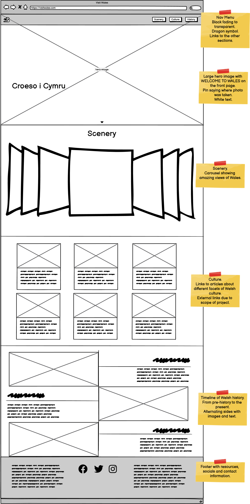
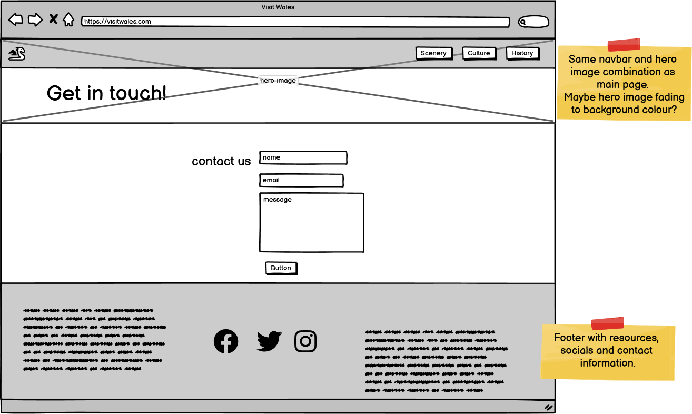
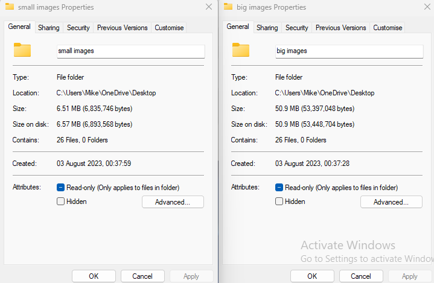

# README

## GOAL - CLIENT/CUSTOMER

I wanted to make an image heavy tourism website to highlight the beauty of Wales and encourage people to visit.

## DESIGN

I wanted to highlight the beauty and culture of Wales. The best way to do this is using image gallerys, catchy catchy sounding articles with images, and encouraging people to learn more about the history and future of the country.

but I wanted the front page to be a large full-page image with all text overlaid. This needed to be as high-resolution as possible  within the limits of website efficiency.

I wanted solely white text to maintain the crisp, clean look. The navbar would need to black and opaque in some way to ensure the white text wasn't lost among the white of the sky/clouds. This boosts the contrast and makes the text easier to read.

For the writing over the land, bumping the colour from off-white to plain white was sufficent to bump that contrast up.

I used pure white and a drop shadow for the text over hero image to boost the contrast and increase readability.

I avoided using pure white/black as it can contribute to eye strain - <https://uxmovement.com/content/why-you-should-never-use-pure-black-for-text-or-backgrounds/>

The main sections cover the three main facets of any countries tourism: scenery, culture, and history. Wales is rich in all three.

### WIREFRAMES

## TOOLS

HTML - Markup
CSS - Styling
Bootstrap 5.3 - Layout, alignment, and components
Font Awesome - Icons
Google Fonts - Righteous and REM fonts.
Balsamiq - Wireframes

## TUTORIALS AND CODE FOUND ELSEWHERE

I used the following tutorial to create the webkit line clamp code for the card text in the culture section. I wanted them to look like they actually led to articles elsewhere on the site. https://blog.logrocket.com/ways-truncate-text-css/

I used <https://www.w3schools.com/css/css3_gradients.asp> to create the gradient effect on the nav bar.

I used the bootstrap documentation to set up the scenery carousel and the cards for the culture section.

## TOOLS

Error Checking - https://webformatter.com/html - Revealed several mixed opening (H5) and closing (H3) header tags and an errant 
 tag. 

I used <https://tinypng.com/> to compress the all the images on the site and <https://pixelied.com/convert/jpg-converter/> to convert them to .webp format. 

## CHALLENGES

One of the biggest challenges was finding royalty free images of sufficient tone and quality. If this project was being created at a professional level, paid images would be more likely to be employed. 

I had to use the following tutorial to fix the height of the scenery carousel - <https://raybo.org/posts/2021-03-27-consistent-height-carousels-with-css-gradients-by-hacking-the-bootstrap-5-carousel/>

## TESTING

All links, internal and external, have been thoroughly tested.

All links opening to external pages create new pages, so that the main page maintains its presence. Due to the scope of the project, all links to potential articles link to the best possible third-party site for further information.

Every section has been tested for responsiveness and responds to changes in screen size differently.

The only error that repeatedly appeared in the W3 Validation was "Error: A charset attribute on a meta element found after the first 1024 bytes". The only answer I was able to find online for it was to move the meta tag to the very top of the head tag but mine was already there from setting up the basic structure with Emmet.

I tested the site's performance using Lighthouse. 

### LIGHTHOUSE

Initially the [performance scored 78%](assets/docs/Lighthouse_Summary_1.pdf). The images being the main thing hampering its performance.

After using TinyPNG to compress the images, the [score rose to 90%](assets/docs/Lighthouse_Summary_1.pdf). 

I then used Pixelied to convert the images to .webp format and the score [rose again to 92%](assets/docs/Lighthouse_Summary_1.pdf).

## DEPLOYMENT

Deployed using GitHub Pages.

1. Navigate to Github repository, ensuring there is an index.html file there (the main page).
2. Click settings.
3. Under Code and Automation, select pages.
4. Under "Build and deployment", under "Source", select Deploy from a branch. Choose Main branch and /root. Save.
5. At the top of the pages menu, there should be a link to the deployed page.

I decided the use the official tutorial rather than refer back to the example on the course as the workflow of finding information this way is closer to how the information would be found when working in a typical role. There could also potentially be some new material/information.

Link to deployed page - <https://mikemurray13.github.io/milestone-project-1/>

## FUTURE UPDATES

I'd like to merge the scenery carousel with the hero-image so the hero image cycles through images when you visit the page to keep it fresh.

I'd like to learn more about aria controls to increase accesibility.

Implement the option to change the language from English to Welsh.

As the hero image is taller than wide on smaller screens, having the image scroll back and forth would give the viewer the sense of a more panoramic view.

### CREDITS

**#### LANDING SITE**
Hero Image - Mitchell Orr - <https://unsplash.com/photos/Ddp_T92Vjus?utm_source=unsplash&utm_medium=referral&utm_content=creditShareLink>

**#### SCENERY**
Gower Peninsula - <https://commons.wikimedia.org/wiki/File:Morning_Sun_at_Three_Cliffs_Bay>,_Gower.jpg>
Snowdonia - <https://commons.wikimedia.org/wiki/File:Llyn_Llydaw_from_Crib_Goch_2.jpg>
Brecon - <https://www.flickr.com/photos/126654539@N08/19691578100>
Pembrokeshire Coast - <https://commons.wikimedia.org/wiki/File:Pembrokeshire_Coast_National_Park_01.jpg>
Llyn Peninsula - <https://www.geograph.org.uk/photo/4976829>

**#### CULTURE**
Folklore - <https://www.worldhistory.org/Cernunnos/>
Welsh Flag Image - Taken by myself at YesCymru Independence March, Swansea. Feel free to use it. Link appreciated.
Welsh Cakes - <https://www.shutterstock.com/image-photo/homemade-welsh-cakes-raisins-milk-close-449061619>
St David's Day - <https://commons.wikimedia.org/wiki/File:St._David%27s_Day_parade>,_Cardiff_-_geograph.org.uk_-_3867279.jpg>
Rugby - <https://commons.wikimedia.org/wiki/File:Rugby_world_cup_2011_wales_fidji_tackle_6_octobre_2011.jpg>
Dylan Thomas - <https://pixabay.com/photos/dylan-thomas-house-writing-poetry-2541797/>
Eisteddfod - <https://www.shutterstock.com/image-photo/cardiff-wales-august-2018-national-eisteddfod-1148093045>
Hay On Wye - <https://www.hayfestival.com/wales/press-images>
Cardiff Castle - <https://www.pxfuel.com/en/free-photo-oqdcv>

**#### HISTORY**
Goat's Hole - <https://www.gowerholidays.com/things-to-do-see/attractions/paviland-cave/>
Great Orme - <https://commons.wikimedia.org/wiki/File:Great_Orme_Copper_Mine_-_geograph.org.uk_-_819.jpg>
Henllys - <https://www.shutterstock.com/image-photo/reconstruction-iron-age-fort-castell-henllys-1121207735>
Caerleon - <https://commons.wikimedia.org/wiki/File:Caerleon_Roman_Fortress_Baths_20171016_apodyterium.jpg>
St David's Cathedral - <https://www.visitwales.com/attraction/historic-site/st-davids-cathedral-509444>
Holyhead Museum - <https://nmmc.co.uk/2017/01/goodbye-to-viking-voyagers/>
Conwy Castle - <https://www.publicdomainpictures.net/en/view-image.php?image=25764&picture=conwy-castle-wales>
Sycarth - <https://commons.wikimedia.org/wiki/File:Sycharth_home_of_Owain_Glyndwr>,_Last_Prince_of_Wales_10.jpg
Big Pit - <https://commons.wikimedia.org/wiki/File:Wales_blaenavon_bigpit.jpg>
Senedd - <https://upload.wikimedia.org/wikipedia/commons/thumb/7/77/Senedd_%2851845859151%29.jpg/1024px-Senedd_%2851845859151%29.jpg>

**#### CONTACT PAGE**
Hero Image - <https://pxhere.com/en/photo/1626925>

Thank you to Mike Jones and Gary Davies for checking the facts.